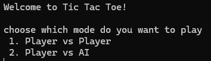
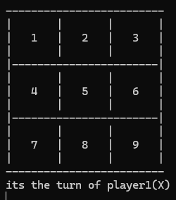
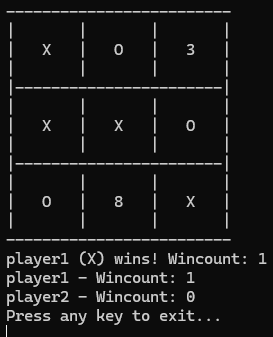
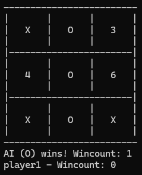

TicTacToe Console Game

A simple C# console Tic-Tac-Toe game created to practice core language fundamentals and basic game logic.

📌 Project Overview

This project includes a playable Tic-Tac-Toe with two modes:

Game Modes

Player vs Player

Player vs AI (AI uses Minimax to choose the best move) 

Program

Implemented Concepts

Console UI

Board rendering in console

Turn-based input with validation 

Program

Conditionals & Loops

while, do/while, if/else

Arrays

char[] board ('1'..'9')

Collections

Dictionary<int, Player> for storing players

Input Validation

int.TryParse

Checking allowed moves ('1'..'9', only empty cells)

OOP Basics

Player class with Name property validation and winCount 

Player

Game Logic

Win checking with all combinations

Draw detection 

AI Logic

Evaluate, Minimax, AiMove 

🛠 Technologies Used

C#

.NET Console Application

Visual Studio

## 📸 Screenshots

### Game Menu

### Board

### PvP Win

### AI Win

▶ How to Run

Open the solution in Visual Studio 

tictactoe console game

Build and run the project (Start / F5)

Choose a mode:

1 — Player vs Player

2 — Player vs AI 

🎮 Controls

Use keys 1–9 to place your symbol in the corresponding cell.

Invalid inputs are ignored and you will be asked again. 

🎯 Purpose

This project is intended for:

Practicing C# fundamentals in a real console project

Understanding game loops and state management

Learning basic AI decision-making using Minimax
